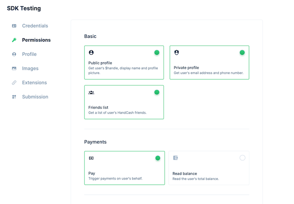
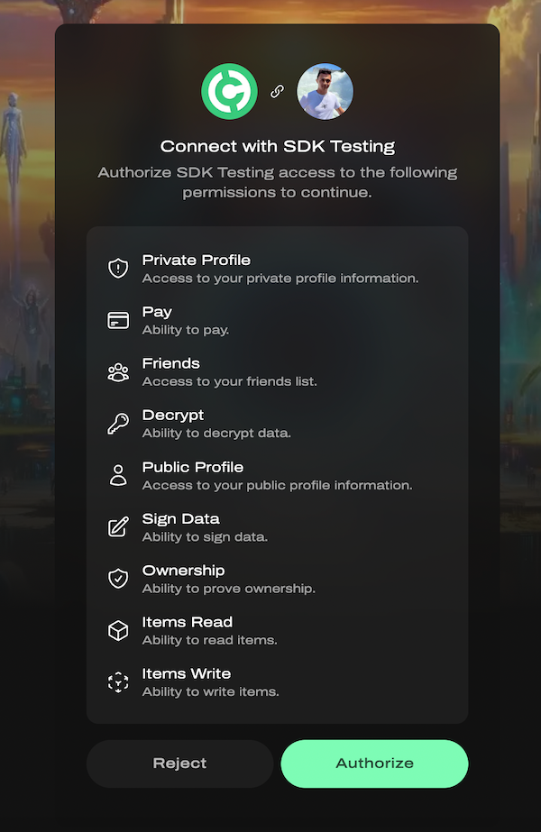
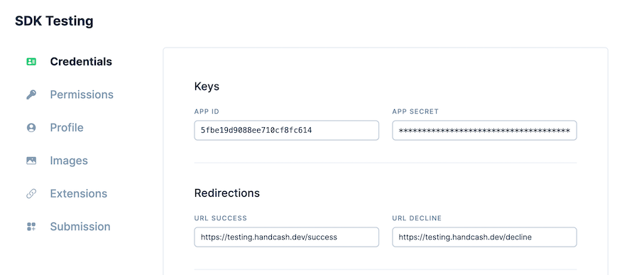

HandCash SDK is a server-side Node.js SDK designed for secure interaction with HandCash accounts.

## Requirements

- Node `v16.X` or higher
- Only for NodeJS, i.e. it doesn't work on the browser side as it's a server-side library for security reasons.

## Documentation

- [Getting started](#getting-started)
- [HandCash Connect](#handcash-connect)
  - [Understanding permissions](#understanding-permissions)
  - [Creating User Accounts](#creating-user-accounts)
  - [Accessing Existing User Accounts](#accessing-existing-user-accounts)
  - [Get user profile](#get-user-profile)
  - [Get user inventory](#get-user-inventory)
  - [Transfer money](#transfer-money)
  - [Transfer items](#transfer-items)
- [HandCash Items](#handcash-items)
  - [Create a collection](#create-a-collection)
  - [Create items](#create-items)
- [Learn more](#learn-more)

## Getting started

### Developer dashboard


This SDK requires an `appId` to represent your application and an `appSecret` to ensure the SDK is securely invoked under your control.

> Don't have an app yet? Sign-up for [dashboard.handcash.io](https://dashboard.handcash.io) and create your first app.
>

### Installation

`npm i @handcash/handcash-connect`

## HandCash Connect

To start, you will need to create an instance of `HandCashConnect`. This object allows you to interact with the SDK.

A `HandCashConnect` requires an `appId` to represent your application and an `appSecret` to ensure the SDK is securely invoked under your control.

```typescript
import { HandCashConnect } from '@handcash/handcash-connect';

const handCashConnect = new HandCashConnect({
	appId: 'your-app-id',
	appSecret: 'your-app-secret',
});

```

### Understanding permissions

The `authToken` represents the granted permissions to read the user's profile, balance, items, and money.

You can define the permissions that your app requires from the dashboard.



### Creating User Accounts


### Accessing Existing User Accounts

To access user accounts, you need to obtain an `authToken` that represents the granted permissions to read their profile, balance, items, and money.

You can find out more about [the user authorization process](https://handcash.github.io/handcash-connect-sdk-js-beta-docs/#/user-authorization).

1. Get the `redirectionUrl` that redirects the user to HandCash to obtain the `authToken`

```typescript
const redirectionUrl = handCashConnect.getRedirectionUrl();
```

2. Redirect the user to the `redirectionUrl` from your end.
3. The user will be prompted to authorize your app to their account.



4. Once the user is redirected back to your app with the `authToken`, you are ready to go!

```typescript
const account = handCashConnect.getAccountFromAuthToken(authToken);
```

🔎 You can define the URL where the user will be redirected after authorizing your app from the dashboard.



### Get user profile

The following code shows how to get the user's profile.

```typescript
import { HandCashConnect } from '@handcash/handcash-connect';

const handCashConnect = new HandCashConnect({
   appId: '<app-id>',
   appSecret: '<secret>',
});

const account = handCashConnect.getAccountFromAuthToken(token);
const { publicProfile } = await account.profile.getCurrentProfile();

console.log(publicProfile);
```

### Get spendable balance

Users can limit how much apps can spend in a daily based on their preferences.

The following code shows how your app can get the user spendable balance.

```typescript
import { HandCashConnect } from '@handcash/handcash-connect';
const handCashConnect = new HandCashConnect({ 
   appId: '<app-id>', 
   appSecret: '<secret>',
}); 

const account = handCashConnect.getAccountFromAuthToken(token);
const items = await account.items.getItemsInventory({ from: 0, to: 50 });

console.log(items);
```

Check out the [spendable balance docs](docs/spendableBalance.md) to learn more.


### Get user inventory

The following code shows how to get the items that the user has in their inventory.

```typescript
import { HandCashConnect } from '@handcash/handcash-connect';
const handCashConnect = new HandCashConnect({ 
   appId: '<app-id>', 
   appSecret: '<secret>',
}); 

const account = handCashConnect.getAccountFromAuthToken(token);
const items = await account.items.getItemsInventory({ from: 0, to: 50 });

console.log(items);
```

You can use filters to get specific items from the user's inventory. Check out the [inventory docs](docs/getItemsInventory.md) for more information.


### Transfer money

The following code shows how to make a simple payment from the user's wallet to another user.

```typescript
import { HandCashConnect } from '@handcash/handcash-connect';
const handCashConnect = new HandCashConnect({ 
   appId: '<app-id>', 
   appSecret: '<secret>',
}); 

const account = handCashConnect.getAccountFromAuthToken(token);
const paymentParameters = {
    description: "Hold my beer!🍺",
    payments: [
        { currencyCode: 'USD', sendAmount: 0.25, destination: 'nosetwo' },
    ]
};
const paymentResult = await account.wallet.pay(paymentParameters);

console.log(paymentResult);
```

Learn more about payments from the [payments docs](docs/transferMoney.md).

### Transfer items

You can transfer items from the user's inventory to other users.

The following code shows how we can transfer an item with origin `27c02c976adbf0acb212b850ce0c0b1b796de0a646c93304f94f2dc3249cad25_33` to the user `TKillah`.

```typescript
import { HandCashConnect } from '@handcash/handcash-connect';
const handCashConnect = new HandCashConnect({ 
   appId: '<app-id>', 
   appSecret: '<secret>',
}); 

const account = handCashConnect.getAccountFromAuthToken(token);
const result = await account.items.transfer({
  destinationsWithOrigins: [
    {
      origins: ['27c02c976adbf0acb212b850ce0c0b1b796de0a646c93304f94f2dc3249cad25_33'],
      destination: 'TKillah',
    }
  ]
});

console.log(result.transactionId);
```

> 🤓 The item origin represents the unique identifier of the item on the blockchain.

Learn more about items from the [items docs](docs/transferItems.md).

## HandCash Items

HandCash Items allows you to easily create and manage digital items on the blockchain.

⚠️ This feature requires your app to be whitelisted. Please contact us. 

### Initialize HandCash Items

```typescript
import { HandCashMinter } from '@handcash/handcash-connect';

const handCashMinter = HandCashMinter.fromAppCredentials({
   appId: '<app-id>',
   appSecret: '<secret>',
});
```

### Create a collection

In order to create items, first we need to create a collection and then create items referencing the collection.

The following code shows how to create a collection.

```typescript
const creationOrder = await handCashMinter.createCollectionOrder({
  name: 'My first collection',
  description: 'This is my first collection. Do not judge me.',
  mediaDetails: {
    image: {
      url: 'https://res.cloudinary.com/handcash-iae/image/upload/v1685141160/round-handcash-logo_cj47fp_xnteyo_oy3nbd.png',
      contentType: 'image/png'
    }
  }
});
const items = await handCashMinter.getOrderItems(creationOrder.id);

console.log(`Collection Created, collectionId: ${items[0].id}`);
```

Copy the `collectionId`. You will need it to create items.

### Create items

The following code shows how to create items. Remember to replace the `collectionId` with the one you created in the previous step.

```typescript
const creationOrder = await handCashMinter.createItemsOrder({
    collectionId: 'replace-with-your-collection-id',
    items: [
      {
         user: '6213a44bf2936f711c8d19d3',
         name: "My first item",
         rarity: "Mythic",
         attributes: [
            { name: "Strenth", value: 10, displayType: "number" },
            { name: "Speed", value: 9, displayType: "number" },
            { name: "Skin", value: "Purple", displayType: "string" },
         ],
         mediaDetails: {
            image: {
               url: "https://res.cloudinary.com/handcash-iae/image/upload/v1702398977/items/jyn2qqyqyepqhqi9p661.webp",
               imageHighResUrl: "https://res.cloudinary.com/handcash-iae/image/upload/v1697465892/items/zq0lupxoj8id1uedgz2h.png",
               contentType: "image/webp"
            }
         },
         quantity: 3
      },
    ]
});
const items = await handCashMinter.getOrderItems(creationOrder.id);

console.log('Items created', items);
```

If we run the code above, the user with ID `6213a44bf2936f711c8d19d3` will receive 3 items named `My first item` with the attributes `Strenth`, `Speed`, and `Skin`.

About the `mediaDetails`:
- `url`: represents the image that will be stored on the blockchain to represent this item.
- `imageHighResUrl`: represents the image that will be shown for the item in the inventory and in the market.


## Learn more
- [HandCash Items example](https://github.com/HandCash/handcash-items-example): a repository with a simple examples of how to create and manage HandCash Items.
